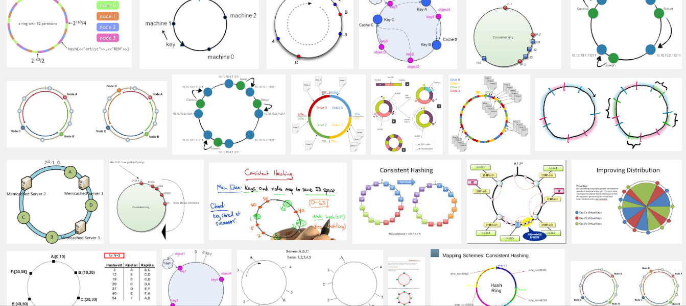
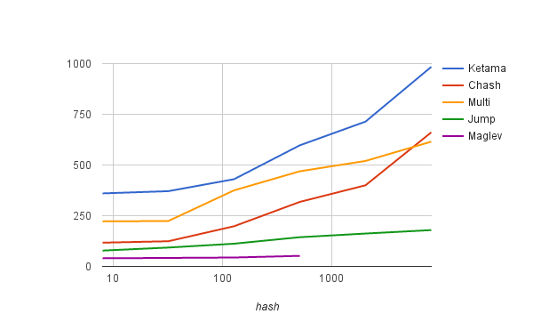

class: center, middle, inverse

## consistent hashing in go

---

# a problem

- I have a set of keys and values

--

- I have some servers for a k/v store (memcache, redis, mysql)

--

- I want to distribute the keys over the servers so I can find them again

--

- *without* having to store a global directory

---

# mod-N hashing

- hash(key) % N

--
- easy

- fast (except for the modulo operator)
--

    - but other things will be slower
    - and watch out for slow hash functions (sha1...)

--

- changing N means almost every key will map somewhere else

--

- what would be optimal?
  - when adding/removing servers, only 1/nth of the keys should move
  - don't move any keys that don't need to move

---
# consistent hashing

- 1997: Consistent hashing and random trees: distributed caching protocols for relieving hot spots on the World Wide Web

--

- 2007: Ketama (last.fm)
- 2007: Amazon's Dynamo paper

--

- standard scaling technique
    - Cassandra
    - Riak
    - basically every distributed system that needs to distribute load over servers

---

# ring-based hashing

- points on a circle

--

- add point for each `hash(node_i)`
- find the first `node_i` such that `hash(key) <= hash(node_i)`

--

- vnodes: each node appears multiple times
    - reduces variance
    - allows weighting

---



---


# ring-based hashing -- insert (groupcache)

```go
func (m *Map) Add(keys ...string) {
	for _, key := range keys {
		for i := 0; i < m.replicas; i++ {
			hash := int(m.hash([]byte(strconv.Itoa(i) + "_" + key)))
			m.keys = append(m.keys, hash)
			m.hashMap[hash] = key
		}
	}
	sort.Ints(m.keys)
}
```

---

# ring-based hashing -- lookup (groupcache)

```go
func (m *Map) Get(key string) string {
	hash := int(m.hash([]byte(key)))

	idx := sort.Search(len(m.keys), func(i int) bool { return m.keys[i] >= hash })

	if idx == len(m.keys) {
		idx = 0
	}

	return m.hashMap[m.keys[idx]]
}
```

---

# ketama (last.fm)

- memcache client
- needed for compatibility at $WORK

--

```c
    unsigned int k_limit = floorf(pct * 40.0 * ketama->numbuckets);
```

--
```c
    float floorf(float x);
    unsigned int numbuckets;
    float pct;
```

--

```go
    limit := int(float32(float64(pct) * 40.0 * float64(numbuckets)))
```

--

- immediately wrote libchash which doesn't depend on floating point round-off error

---

# "are we done?" OR "why is this still a research topic?"

--

- unequal load distribution
    - 100 points per server gives stddev of ~10%
        - 99% CI for bucket size: (0.76, 1.28)
    - 1000 points per server gives ~3.2% stddev
        - 99% CI for bucket size: (0.92, 1.09)

--

- memory requirements for 1000 shards
    - 4MB of data
    - O(log n) search times (for n=1e6)
    - all of which are cache misses
---

# jump hash

- Google, 2014: https://arxiv.org/abs/1406.2294

--
    - but actually, Google 2011 in Guava

--

- no memory overhead
- even key distribution
    - stddev 0.000000764% -> (0.99999998, 1.00000002)

- *fast*

---
# jump hash

```go
func Hash(key uint64, numBuckets int) int32 {
	var b int64 = -1
	var j int64

	for j < int64(numBuckets) {
		b = j
		key = key*2862933555777941757 + 1
		j = int64(float64(b+1) * (float64(int64(1)<<31) / float64((key>>33)+1)))
	}

	return int32(b)
}
```

---

# jump hash -- downsides

- doesn't support arbitrary bucket names

--

- can only add/remove buckets at the end

--

- only applicable for data storage cases

---

# "are we done?" OR "why is this still a research topic?" (2)

--

- can't use arbitrary bucket names

- how to get low variance without the memory overhead

---

# multi-probe consistent hashing

- Google, 2015: https://arxiv.org/abs/1505.00062

--

- O(n) space but O(k) lookup time
  - sneaky data structure to prevent O(k log n)

--

- instead of multiple points on the circle, hash each node once but hash the key k times

- for low variance ("1.05 peak-to-mean ratio")
    - k = 21 lookups
    - J = 700 ln n points on the circle

---



---

# others

- rendezvous hashing (1997, https://www.eecs.umich.edu/techreports/cse/96/CSE-TR-316-96.pdf )
- SPOCA (2011, https://www.usenix.org/legacy/event/atc11/tech/final_files/Chawla.pdf )
- maglev hashing (2016, http://research.google.com/pubs/pub44824.html )

---

# source code

- https://github.com/dgryski/go-ketama
- https://github.com/dgryski/libchash / https://github.com/golang/groupcache
- https://github.com/dgryski/go-jump
- https://github.com/dgryski/go-mpchash
- https://github.com/dgryski/go-maglev

---
class: center, middle, inverse

## fin

???

vim: ft=markdown
