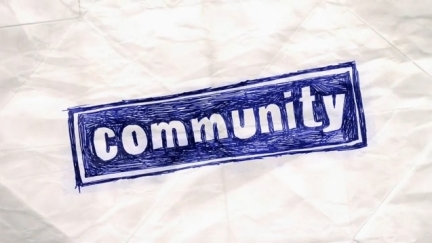
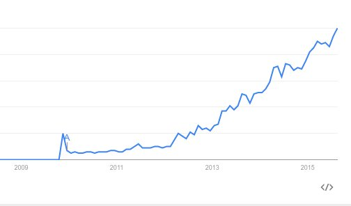
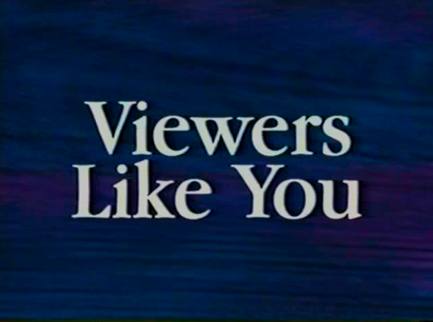
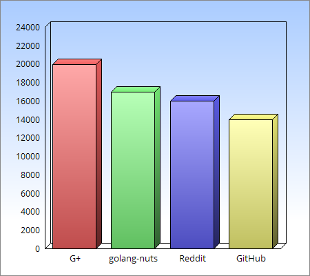
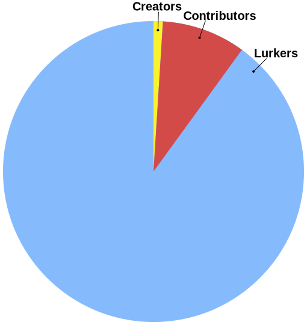
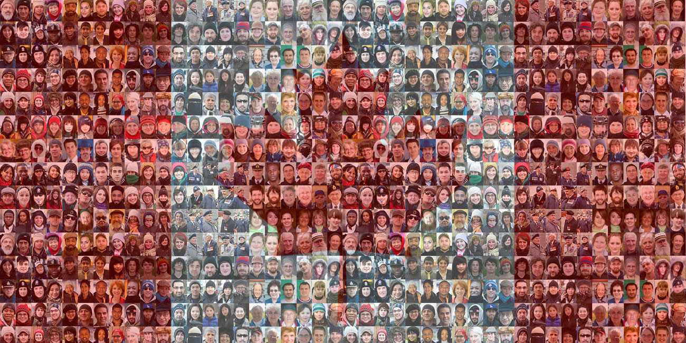

class: center, middle, inverse

## the go community

???

---

.center[]

.center[
@dgryski

github.com/dgryski

reddit.com/u/dgryski
]

???

Hello, my name is Damian, I am a developer at Booking.com.  I work in our
Reliability Engineering Group focussing on Infrastructure Monitoring.

I'd like to thank you all for coming to the conference today, and I'd like to
thank the organizers for giving me the honour of delivering the closing
keynote.

Now, normally I give fairly technical talks.  But not today.  Instead, I'm
going to talk about community, which seems to be a common topic for conference
keynotes.  I'm much more comfortable giving technical talks.  On the other
hand. I'm an extrovert so I could stand up here and talk about chickens for 30
minutes if I wanted to.

If you've ever read the golang subreddit, you’ve probably seen my username.  If
you’ve tweeted a question with #golang, there’s a good chance you've interacted
with me.  And I suppose that's why I was asked to stand up here and talk about
community.  I'm a visible member of the community.  It probably helps that I'm
an extrovert.  I *do* stuff.  I certainly didn't start out saying “Hey, I’m
going to get involved in the Go community”, I just sort of fell into it.

---

## What is Community?

--

- Wikpedia:

--
> Community is an American television sitcom created by Dan Harmon that premiered on NBC on September 17, 2009.

.center[]

???

So, what *is* community? Wikipedia says that Community is an American
television sitcom that premiered on NBC in September 2009.  But if you read
further, you see it’s about a group of people who come together to form a study
group and their shared experiences.  This sounds like a better definition: a
group of people with shared values.

---

## Do Gophers have community?

--

- Wikipedia:

--
> Gophers are solitary outside of breeding season.

- A *concurrence* of (Go) Gophers

???

Do Gophers have a community?  Back to Wikipedia. “Gophers are solitary outside
of breeding season”  So, basically not.  This, by, the way, is where there’s no
collective noun for a group of gophers.  Although Michael Jones has suggested the
wonderful phrase “a concurrence of gophers”.

---

???

Our “concurrence” is growing, because our community is growing.  And our
community is growing because people are interested in learning more about Go.
Lots of different backgrounds: different languages both computer and spoken,
different levels of knowledge, different levels of experience; some self
taught, other have formal training, different areas of focus, different
priorities. *pause*

Naturally, this means the make-up of our community is changing.  And this is
concerning for some..  Something drew us all to Go in the first place.  We want
to ensure that the things that we enjoy, that brought us here, don't change.

---

## Code of Conduct

.center[

]

???

This isn't going to be a talk about Codes of Conduct.  There have been a number
of those already.  The code of conduct I personally try to live by “Be
Excellent to Each Other”.  If the one-sentence version of yours is sufficiently
different, it's probably worth asking “why”.

---
class: center, middle, inverse

## "the" go community

???

So, let’s talk about the Go community.  Can we even talk about “The” Go
Community?

---

class: center, middle, inverse

## "the" go communities

???

I can certainly talk about the Go *communities* I’m a part of.  The
gophers at my work, the Amsterdam Go community, perhaps the Slack, Twitter and
Reddit Go communities, maybe IRC and mailing list.  But what about “the” Go
community?

---

## Community Survey Results

Development Platform

OS       |
-------- | --------
Linux    | 46%
OSX      | 43%
Windows  | 11%

???

Jason Buberel, the Product Manager for the Go Team at Google, posted the
results of a community survey:

--

- Where are the Windows users from China?

- Downloads, Google Trends, "Build Web Applications in Go"

- Why is Go so popular in China?

???

And yet, these results are at odds with the fact that we *know* the most
popular downloads of the Go installer are Windows users from China.  So
clearly, the Windows-using Chinese developers are not talking loudly on the
go-nuts mailing list.  Google Trends, also, shows the immense popularity of
'golang' in China.  Before Docker and Kubernetes, the most starred Go
repository was Asta Xie’s book “Build Web Applications in Go”, available only
in Chinese.  There was even a blog post trying to answer the question “Why is
Go so popular in China?”

---

## GopherChina

.center[]

- Qihoo 360 running 10B messages/day with 200M+ real-time connections.
- Baidu running 100B requests/day through Go.

???

One thing to come out of GopherChina conference in Shanghai was the immense
scale some of these Chinese users were running at.

The rest of us hadn’t heard anything about this, or even hardly anything about
these companies.  There was just a feeling Go was taking off in China.

So clearly, there is a Go community a China.  A huge one from the looks of it.
But one that has little in common with the rest of us.

Which brings up another interesting point.

---

## Who are "the rest of us" ?

--

- All the gophers outside of China

???

We could say "all the gophers outside of China".

--

- golang-nuts@, #go-nuts, #golang, /r/golang

???

We have the communities I mentioned earlier: the mailing list, IRC, twitter, reddit

--

.center[]

???

People who attend conferences like this one.

---

## Gophers by the numbers

.center[]

???

 G+          | 20000
 golang-nuts | 17000
 /r/golang   | 16000
 GitHub      | 14000

Obviously these are not all independent groups; there’s overlap.  But here's an
interesting question:  How many people are writing Go code but are not
subscribed to the mailing list?  How many people are writing Go code, but don't
read the subreddit?  Are these people part of our community?  Are they Gophers?
Well, they’re Go developers.  Is there a difference?  Our community needs to be
accessible to everyone.

---

.center[]

.footnote["1percentrule" by Life of Riley - Own work. Licensed under CC BY-SA 3.0 via Commons]

???

We know there are more developers that. There’s a rule of thumb about
participation in online communities:  1:9:90.  1% create content, 9%
contribute, and 90% lurk.  1% write blog posts.  9% comment on Reddit and
Hacker News.  90% lurk.  That’s a lot of people we hear nothing from.  Are
those 10% who *are* active sampled uniformly at random from the entire
population?  Unlikely. So we *know* the Gopher activity we see represented
online is not the entire picture.

And this doesn’t even include  “dark matter developers”, who aren't involved in
the community at *all*, not even to lurk.

We need make decisions that don’t just reflect what we see, which is skewed,
but that tries to make sense for cases we haven’t considered.  This is what
Russ Cox meant by “do less, to enable more” in his GopherCon keynote.

---

.center[]

???

It’s obviously hard to quantify the needs of "dark matter gophers".  But
they’re still writing code.  They still consider themselves part of the Go
community.  In fact, these people you don't see or hear from, probably make up
the majority of users.  They have an impact on adoption.  They have an impact
on mindshare.  We might call them the subconscious mind of the Programmer
community.

We don’t know how many of them are out there.  We don’t really even know what
they’re using Go for.   What do you do if most of your community is invisible?
We’re not getting bug reports from them.   We’re not getting patches from them.
How skewed is our view of the world without them?

How skewed is our view of the world without more insight into what's happening
in China?

---

## What do Go programmers want from their community?

--

- meeting like-minded people
- finding great content
???

Why do people get involved in an online community anyway?  Luckily, there’s
research on this topic.  Two common motivators are: “meeting like-minded
people” and “finding great content”.

These are pretty generic reasons, but they apply offline too.  Why are you here
today?  Maybe your company sent you here as a perk and you don’t really care.
But probably it was one, or perhaps both of these.  You want to meet some other
gophers, and you want to learn some things.

“We like people who are like us.”  A principle from social psychology of
influence.  When you meet some gophers, you already have something in common,
already have a connection.  Since they like Go, it’s likely share your beliefs
on what being a Gopher entails.  They’re part of your tribe.

--

- technical community
   - learn
   - recommendations for packages, solutions
   - upcoming changes, bugs

???

At the same time, we are a technical community. We want places where you can
get help: where we can learn, without being made to feel stupid.
Recommendations for packages to use, or the best approach to solve a problem.
A place to discuss other Go-related topics.  Upcoming changes in the new
release.  Bugs.

We want our communities to be friendly places.

---

## What do we believe?

--

- Code
    - gofmt
    - if err != nil { ... }
    - go vet
    - go build -race
    - golint (CodeReviewComments)
    - godoc.org/github.com/user/package
    - go get
    - interface{}

--

- Social
    - Simple is better than complex
    - Performance matters
    - Costs are visible

???

This is the culture we want to preserve.  These are the values that brought
many of us to Go in the first place. These are the ideas we want to propagate
to newcomers.

This to some extent *is* the underlying “gopherness” we want to keep in the
community.  This is what we’re scared of losing. We want the community to
respect these beliefs, because that's what's important to us.

The Go community is seeing an influx of new people, and many of them are trying
to bring their own development habits, informed by their experiences in
previous languages and previous communities, to ours.  Go’s Eternal September,
if you like.

---
class: center, middle, inverse

## change

---

## Accents

???

Francesc Campoy-Flores gave a great talk at dotGo last year on accents, both in spoken
languages and computer languages.  French with a Spanish accent. Go with a Java
accent, or Go with a Python accent.

--

- BBC English

- "Moutain View" Go

???

Consider, then, BBC English.  Received Pronunciation.   The equivalent for
Gophers would be the “accent” of Mountain View.  The “proper” way to speak.
The “proper” way to code.

---

.footnote[Canadian flag mosaic by Tim Van Horn, Canadian Mosaic Project]

???

There's an interesting Canadian term that applies here: “Cultural mosaic”.
It’s the mix of ethnic groups, languages and cultures that coexist within
society.  We use it when discussing government policy on multiculturalism.  It
stands in opposition to the “melting pot” metaphor that’s often used in
American discussions on cultural assimilation.

For a while, the Go community ideal *was* cultural assimilation.

Write code like the standard library.  Idiomatic code above all else.   We
wanted people to conform.  You must write code like this.   You must drink this
kool-aid.

As Russ Cox pointed out in his GopherCon keynote:  The Go community needs to
exist outside of Google, doing things that Google isn’t doing.

We need diversity.  We need different ideas, different backgrounds.  This is
how we become a "technical cultural mosaic", where our differences contribute
to the whole, instead of dividing it. We’re all exploring still.  We don’t yet
know the best way to do everything.  Our current ideals are really “This is the
best way we’ve found to do it so far”.

Many of these "best ways" reflect the experience of the Go team, but as we’ve seen
with vendoring living inside the Google Bubble doesn’t always produce solutions
that satisfy those outside.

---

## &nbsp;

.center[]

???

It’s always important to understand *why* we do these things.  Otherwise you
end up doing things out of habit, even though they don’t make sense any more.
For example, buying a roast from the butcher, and cutting off the small end
before putting it into the roasting pan to cook.  “My mother always did it this
way.”  One day you call your mom and you find out it’s because her roasting pan
was too small.

Different people have different needs.

I have a bigger roasting pan than my mother.

---

.center[

]

???

Let’s take Martini.  By any measure, it’s a very successful project: 7400
github stars.  Active community.  Lots of contributors, both to martini itself
and the ecosystem.  Used in lots of projects.  Yet many people look down on it
and its users because it's "not idiomatic".  They point to the blog post Jeremy
Saenz wrote disclaiming his own project.  But clearly there’s something there.
Are we really going to tell people “No true Gopher uses Martini?”  These people
are trying to get stuff done.  They have different priorities.  We have to
accept that there will not be the One True Way for people.  There will be
different … I don’t want to say “factions”, but sub-communities.  Gopher towns.
Some will want to follow the shoe, some will follow the gourd.

People *are* going to be building packages that are “non-idiomatic”.  And the
success of Martini led people to build more frameworks that achieved similar
things, but with less magic, that spoke with a more Mountain View accent.  And
our community is stronger for it.

So, we can treat things like gofmt and error checking, as oaths in the
citizenship ceremony.  Or perhaps less formally the shibboleths.  But there’s
still a lot of leeway for people to experiment with, and Go’s success depends
on them doing so.

---
class: center, middle, inverse

## what I do

???

So, how do you actually improve Go and turn it from a group of programmers into
a community?

I’m going to talk about some of the small things that *I’m* responsible for,
and why I chose to do them.  Each time it was "here's something I can do to
make the world a little bit better for other Gophers."

---

## What I do

--

- Reddit

???

Reddit.  At this point, I’m almost certainly the top submitter to /r/golang.
Why did I start?  Internet points.  Not the most altruistic reason I agree.
But why keep going?  I always read a lot of news sites, and I wanted /r/golang to be populated with articles too.
And since I was seeing them anyway (apparently before lots of other people),
it was easy to drop it into the submit form.

An active subreddit is valuable because it makes it clear the community is
*doing* things.  If you visit a subreddit that has one post only every few
days, the watering hole is dry.  People aren’t going to come back if there
nothing to read.  By filling it with content, people come back. They realize
that 1) there’s stuff happening (the content itself) and 2) there’s a community
of gophers who are talking about it.  A subreddit filled with content satisfies
both of the reasons people join communities.

--

- gophervids.appspot.com

???

Gophervids:
This is the clearest example of me going out of my way to do something to
improve the community.  Except that I didn’t want to do it.

Gophervids is a website (built with bootstrap + angular and well beyond my
front-end capabilities) that at the moment has more than 350 Go talks tagged by
topic and speaker.  I wanted a site like this to exist, and the easiest way to
make that happen was to create it myself.  I had always hoped that somebody
else who actually knew how to build websites would come along and fix it up for
me.  And some people have contributed some CSS cleanups or javascript tweaks.
But mostly it’s me updating a json file by hand once in a while.

However, to some extent, much like my reddit submissions, this was taking
something I was doing anyway: scanning youtube for Go videos, and helping make
that information more widely available in a more useful form.

If you want to watch videos on concurrency, or testing, or optimization, or all
of Andrew's 30+ talks, you can watch them here.

--

- \#golang

???

Twitter:  I answer questions on the #golang hashtag.  I’m a helpful person.

Lots of people tweet questions, problems, whatever, tagged with #golang.
Shouting into the wind, basically.  Most of the time these are beginners who
need help with something, or people looking for packages but they haven’t yet
found godoc’s search feature.  Whatever.

Surprisingly, I’ve also spent a lot of time suggesting to people that they
*don’t* switch to Go.  Or rather, trying to educate them and set expectations
about what they’re getting into.  Why?  I don’t want people coming in unhappy.
In some senses, this actually is selfish too.  If they’re unhappy, they’ll
write angry blog posts that make it to the top of Hacker News and start another
200 comment discussion on why Go is a terrible language.  Nobody wins here.

In 2012, Rob Pike wrote what has become one of our founding documents:
"Language Design in the Service of Software Engineering." In it, he delves into
the reasons behind some of the design decisions in Go.  I’ve probably sent this
talk out 100 times to people asking on Twitter if they should learn Go.  People
have many different use cases for their language, and it’s important that they
understand where Go is coming from.  It might be trying to solve problems they
don’t have -- millions of lines of code, thousands of engineers -- in which
case some of the decisions might not make sense for their kind of work.

People have different beliefs about what a programming language should provide.
And then you can find out what languages match your beliefs, ranging from heavily
dyanamic "liberal" languages (to use Steve Yegge's terminology) to extremely
"conservative" languages like Haskell.  A lot of flame wars on the internet
from people who disagree about the Right Way to do things.   When somebody
coming from node.js or rails says “I want to learn Go”, I send them Rob Pike’s
talk.  Then they can decide “Is this the language for me”.  And that *is*
valuable.

---
class: center, middle, inverse

## what you can do

???

The last section to a good keynote is a call to action.  The A/B-tested “buy
now” button next to the shopping cart.

And here we are.

---

## What you can do

- Grow the community

???

Lets define our goals.  Go has a large community, and there is no evidence that
its growth will slow anytime soon.  Lots of benefits here: more packages, more
edge cases hit, more resources in general. More user groups. More blog posts.
More conferences. However, we want to avoid living in an echo chamber.  As
environments and priorities change, we want to be able to recognize that and
take a critical look at our beliefs.

--

- Write Code

???

Write Code.

This for me is important for two reasons. The first is kind of selfish. I enjoy
writing code.  I write a lot of code.  But I also enjoy having the code I need
already written.  Perl is still a very powerful force, based almost entirely on
the range of package available on CPAN.  Python too, has a huge number of
packages. Separate out internal business logic from the useful code. Push your
code to GitHub.  Write docs and get it listed on godoc.org so others can find
it.   Not just interesting algorithms and papers, but parsers for obscure file
formats.  API clients for web services. 

Second, we learn about Go, and how to use it, but writing actual code.  Much of
what we know about the “best way” to write Go code comes from Google.  But
that’s only because they already have millions of lines of Go.  Millions of
lines of Go code that interacts with their systems, their infrastructure, their
workflows.  They’ve well explored the areas of Go that are important to them.
But what about the areas that are important to you?  There’s lots of ground to
cover before we can say that we really “understand” Go.  

We’ve heard a number of times “The language is done.”  Now we need to see how
it works, to see how people use it, to see what people build.

--

- Write content

???

As I mentioned, there are two reasons people join online communities.  To find
like-minded people, and to find great content.  Right now, a lot of Go content
is "I wrote Hello World in Go and this is how it compares to Haskell".    We
need more about Real World Go.  Content written by Gophers. Not just for other
Gophers, but a wider audience.  Share your success stories with the world, not
just your neighbours.  And share your failures too, because Go is not the right
solution for every problem.  One way we improve Go is by knowing where it
doesn't work.  Maybe it's just missing documentation or maybe it's actually missing
libraries.

--

- Bug reports

???

As a developer, listen to bug reports. Be patient. Remember that not every bug
report you get will be written by a native English speaker, or might not even
be in English, or even written by someone who knows how to write a good bug
report.

File bugs yourself, even if you don’t have a fix.  A known documented bug is better than
an undocumented one.

Leave code better than you found it.  If you’re going to use a library, and "go
vet" or golint flag some issues, fix them and file a PR.  Even if it's just
documenting the exported symbols.

--

- Run tip, beta, rc

???

Finally, run the betas and the release candidates.  We need more testers with
odd use cases.  Go 1.5 was released on Wednesday.  Thursday somebody found a
code generation bug.  The way we keep upgrades painless is by having the
pre-releases exercised with lots of different code bases, with lots of
different server configurations, lots of different production workloads. The
more bugs we can find before the final release version is tagged, the more bugs
real users don't have to wait months for a point release fix -- real users who
might have put their career on the line that Go was the right tool for the job.

---

class: center, middle, inverse

## Be Involved

???

Monday while I was busy procrastinating on this talk, I saw a small library I
thought would make a great example for how to use Dmitry Vyukov’s go-fuzz tool
(which you should all be using, by the way.)  I was hoping somebody else would
do it, but in the end signed up to Medium and banged it out myself.   Sometimes the
best way to get something done is to do it yourself.  And so far I’ve found
that’s the way with building community.

This all really boils down to “Be Involved”.   Whenever you think “I need this
thing”, somebody else does too. You can make it happen.  Even if it's just
starting with markdown on a GitHub gist, you can help build things.  Small
steps.

And that’s what I want to leave you with.  I just “fell into” doing community
stuff.  Doing small things I thought would be helpful to other people.  And you
can too.  Small steps.  Make a difference.  Help people grow.  Respect our
differences.  Stay humble

---
class: center, middle, inverse

## fin

???

Thank you.

vim: ft=markdown
